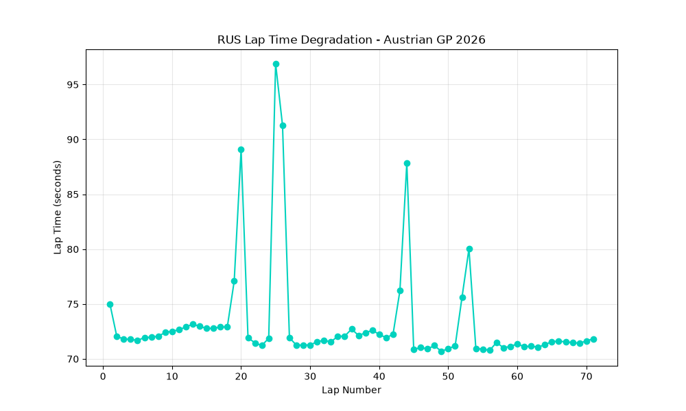

# F1 Tyre Degradation Analyser

A Python tool that analyses real Formula 1 race data to visualise tyre degradation and lap time trends using the FastF1 API.

## What it does

This script pulls live timing data for a chosen driver in a chosen Grand Prix, then plots their lap times across the full race distance. The resulting chart clearly shows:

- Baseline race pace per stint
- Pit stop laps (visible as sharp spikes in lap time)
- Tyre degradation trends within each stint

## Example Output

This example shows George Russell's lap times during the 2026 Austrian Grand Prix. The four major spikes correspond to his pit stops, while the gradual rise in lap time between stops reflects tyre wear.

## Tech Stack

- Python
- [FastF1](https://github.com/theOehrly/Fast-F1) — official F1 timing and telemetry data
- Matplotlib — data visualisation
- Pandas — data handling

## How to Run

1. Install dependencies: `pip install fastf1 matplotlib pandas`
2. Run the script: `python tyre_analysis.py`
3. The chart will display and save automatically as `tyre_degradation.png`

## Why This Project

As an aspiring race strategist, understanding tyre degradation patterns is fundamental to making pit stop decisions in real time. This project is the first in a series exploring data-driven motorsport strategy, building toward an MSc in Motorsport Engineering.

## Author

Hamna Shahzad — BS Electrical Engineering, International Islamic University Islamabad
